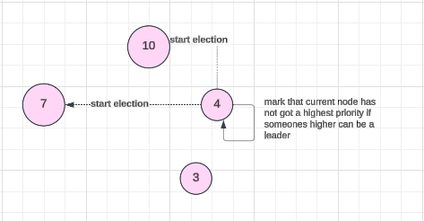

# Bully Algorithm

The **Bully Algorithm** is algorithm to select the coordinator of nodes

---

## Overview of the Algorithm

The Bully Algorithm ensures that:

1. **Election**: When a node identifies that the current coordinator is unavailable (or uninitialized at all), it starts an election process.
2. **Selection Criteria**: The node with the highest priority (typically the highest ID) becomes the new coordinator.
3. **Notifications**: Once a new coordinator is elected, all nodes are notified.

---

## Initialization

The initialization process determines whether the node is the coordinator or must retrieve coordinator information from
other nodes.

```java
public void initCoordinator() throws RemoteException {
    if (coordinatorId == -1) {
        logger.info("The node coordinator is uninitialized. Binding the coordinator...");
        String[] nodeIdList = ServerRegistry.getNodeIdList();
        if (nodeIdList.length == 1) {
            logger.info("The node is first in registry. Initialized node with id " + nodeId + " as coordinator.");
            becomeCoordinator();
            return;
        }

        logger.info("Getting coordinator from existing nodes");
        for (String id : nodeIdList) {
            if (id.equals(String.valueOf(nodeId))) continue;

            try {
                Node node = ServerRegistry.getNodeById(id);

                Node coordinator = node.getCoordinator();
                setCoordinatorId(coordinator.getNodeId());
            } catch (NotBoundException ignored) {
            }
        }
    }
}
```

### Explanation

1. **Uninitialized Coordinator**: `coordinatorId` is `-1` by default.
2. **Single Node**: If the node is the only one in the registry, it automatically becomes the coordinator.

4. **Retrieving Existing Coordinator**: The node queries other nodes in the system to find the current coordinator.

---

## Conditions for Reelection

A reelection occurs when:

**Coordinator Unavailable**: The current coordinator cannot be reached or is deemed unavailable.


### Code Reference

```java

@Override
public Node getCoordinator() throws RemoteException {
    try {
        return ServerRegistry.getNodeById(String.valueOf(coordinatorId));
    } catch (NotBoundException e) {
        logger.warning("Leader with id " + coordinatorId + " not found. Reevaluating leader...");
        this.startElection();
        return this.getCoordinator();
    }
}
```

### Explanation

1. **Coordinator Lookup**: The `getCoordinator` method tries to fetch the current coordinator.
2. **Fallback Election**: If the coordinator is not found, the node initiates a new election using `startElection`.

---

## Election Process

When a node starts an election, it:

1. **Broadcasts**: Sends election messages to nodes with higher priority (higher IDs).
2. **Waits for Response**: If no higher-priority node responds, it declares itself as the coordinator.
3. **Notifies Others**: Informs all nodes about the new coordinator.

### Code Reference

#### Starting the Election

```java

@Override
public void startElection() throws RemoteException {
    logger.info("Node " + nodeId + " Starting election");
    boolean hasHigherPriority = true;

    for (String id : ServerRegistry.getNodeIdList()) {
        if (id.equals(String.valueOf(nodeId))) continue;
        try {
            Node node = ServerRegistry.getNodeById(id);
            if (node.getNodeId() > nodeId) {
                hasHigherPriority = false;
                node.startElection();
            }
        } catch (NotBoundException e) {
            logger.severe("Node with id " + id + " not found");
        }
    }

    if (hasHigherPriority) {
        logger.info("Node " + nodeId + " becomes a leader");
        becomeCoordinator();
    }
}
```

#### Becoming a Coordinator

```java

@Override
public void becomeCoordinator() throws RemoteException {
    setIsCoordinator(true);
    setCoordinatorId(nodeId);
    notifyAll(node -> {
        try {
            node.setIsCoordinator(false);
            node.setCoordinatorId(coordinatorId);
        } catch (RemoteException ignored) {
        }
    });
}
```

#### Notifying Nodes

```java

@Override
public void notifyAll(Consumer<Node> callback) throws RemoteException {
    for (String id : ServerRegistry.getNodeIdList()) {
        if (id.equals(String.valueOf(nodeId))) continue;
        try {
            Node node = ServerRegistry.getNodeById(id);
            callback.accept(node);
        } catch (NotBoundException e) {
            logger.severe("Node with id " + id + " not found");
        }
    }
}
```

### Explanation

1. **Election Broadcast**: Nodes with higher priority are asked to participate in the election.
2. **Priority Check**: If no higher-priority nodes respond, the current node declares itself as the leader.
3. **Coordinator Notification**: All nodes are informed about the new coordinator.
